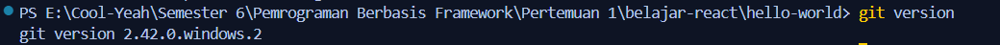
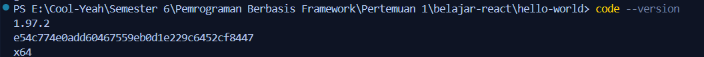
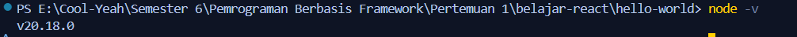
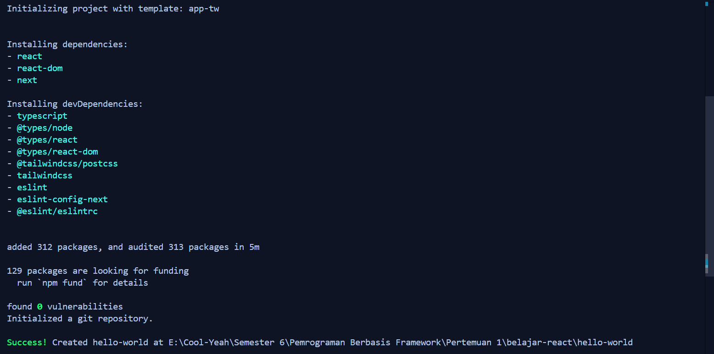
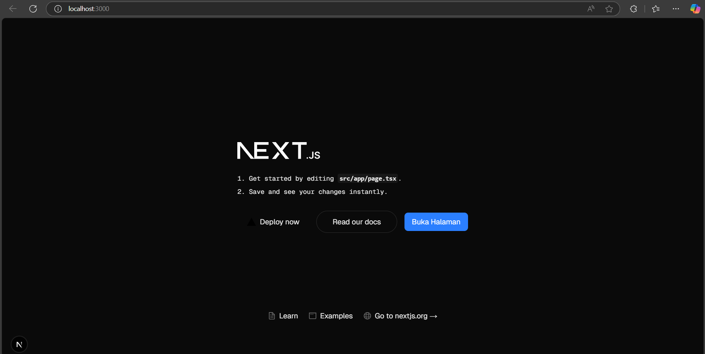
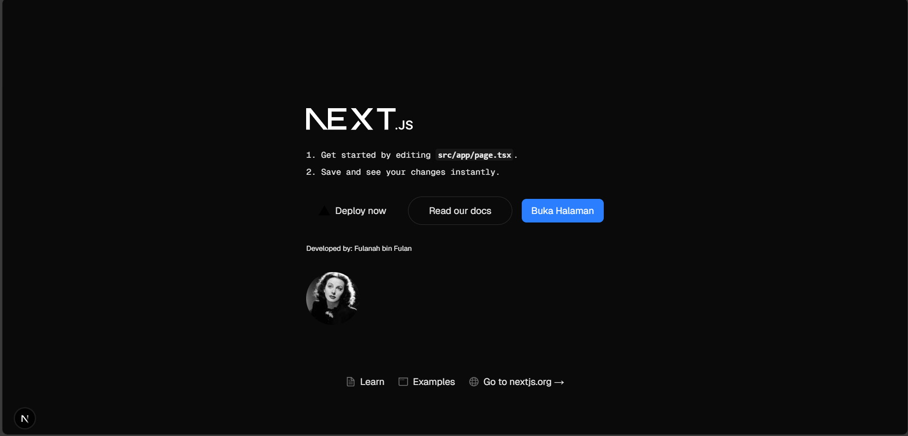

This is a [Next.js](https://nextjs.org) project bootstrapped with [`create-next-app`](https://nextjs.org/docs/app/api-reference/cli/create-next-app).

## Getting Started

First, run the development server:

```bash
npm run dev
# or
yarn dev
# or
pnpm dev
# or
bun dev
```

Open [http://localhost:3000](http://localhost:3000) with your browser to see the result.

You can start editing the page by modifying `app/page.tsx`. The page auto-updates as you edit the file.

This project uses [`next/font`](https://nextjs.org/docs/app/building-your-application/optimizing/fonts) to automatically optimize and load [Geist](https://vercel.com/font), a new font family for Vercel.

## Learn More

To learn more about Next.js, take a look at the following resources:

- [Next.js Documentation](https://nextjs.org/docs) - learn about Next.js features and API.
- [Learn Next.js](https://nextjs.org/learn) - an interactive Next.js tutorial.

You can check out [the Next.js GitHub repository](https://github.com/vercel/next.js) - your feedback and contributions are welcome!

## Deploy on Vercel

The easiest way to deploy your Next.js app is to use the [Vercel Platform](https://vercel.com/new?utm_medium=default-template&filter=next.js&utm_source=create-next-app&utm_campaign=create-next-app-readme) from the creators of Next.js.

Check out our [Next.js deployment documentation](https://nextjs.org/docs/app/building-your-application/deploying) for more details.

## Laporan Praktikum

|  | Pemrograman Berbasis Framework 2024 |
|--|--|
| NIM |  2241720060|
| Nama |  Riski Abdi Rahmawan |
| Kelas | TI - 3B |

### Pertanyaan Praktikum 1

1. Jelaskan kegunaan masing-masing dari Git, VS Code dan NodeJS yang telah Anda install 
pada sesi praktikum ini!

Jawab: 
* Git adalah sistem kontrol versi terdistribusi (Distributed Version Control System) yang digunakan untuk melacak perubahan dalam kode sumber selama pengembangan perangkat lunak.
* VS Code adalah editor teks modern yang dirancang untuk pengembangan perangkat lunak.
* Node.js adalah runtime JavaScript berbasis Chrome V8 Engine yang memungkinkan Anda menjalankan kode JavaScript di luar browser (server-side).
2. Buktikan dengan screenshoot yang menunjukkan bahwa masing-masing tools tersebut 
telah berhasil terinstall di perangkat Anda!

Jawab:
* Git Version

* VSCode Version

* NodeJS Version


### Pertanyaan Praktikum 2
1. Pada Langkah ke-2, setelah membuat proyek baru menggunakan Next.js, terdapat beberapa istilah yang muncul. Jelaskan istilah tersebut, TypeScript, ESLint, Tailwind CSS, App Router, Import alias, App router, dan Turbopack!

    Jawab:
    * TypeScript adalah superset dari JavaScript yang menambahkan fitur static typing (pengetikan statis) ke dalam bahasa pemrograman JavaScript.
    * ESLint adalah alat analisis kode statis (static code analysis tool) yang digunakan untuk menemukan dan memperbaiki masalah dalam kode JavaScript/TypeScript. ESLint membantu menjaga konsistensi gaya penulisan kode dan mencegah kesalahan umum.
    * Tailwind CSS adalah framework CSS utility-first yang memungkinkan Anda membangun antarmuka pengguna dengan cepat menggunakan kelas-kelas utilitas yang sudah didefinisikan.
    * pp Router memungkinkan membangun aplikasi dengan arsitektur React Server Components , yang memungkinkan rendering komponen di server-side secara default.
    * Import Alias adalah cara untuk menyederhanakan impor modul dengan menggunakan alias untuk path tertentu.
    * Turbopack adalah bundler JavaScript yang dikembangkan oleh tim Vercel sebagai alternatif dari Webpack. Turbopack dirancang untuk lebih cepat dan efisien, terutama untuk proyek besar.
2. Apa saja kegunaak folder dan file yang ada pada struktur proyek React yang tampil pada gambar pada tahap percobaan ke-3!

    Jawab:
    * node_modules/ => digunakan untuk menyimpan dependensi proyek.
    * public/ => digunakan untuk menyimpan file statis seperti index.html, favicon, dan aset lainnya.
    * src/ => digunakan untuk menyimpan kode sumber aplikasi React (Komponen, logikan, styling).
    * .gitignore => digunakan untuk menentukan file/folder yang diabaikan oleh git.
    * package.json => digunakan untuk metadata proyek, dependensi, dan script.
    * package-lock.json => digunakan untuk mencatat versi spesifik dependensi.
    * README.md => digunakan untuk dokumentasi proyek.
    * eslint.config.mjs => digunakan untuk mendefinisikan konfigurasi ESLint dalam format modul JavaScript (ESM) .
    * next-env.d.ts => digunakan untuk memberikan tipe data (type definitions) yang sesuai dengan konfigurasi Next.js, sehingga Anda dapat memanfaatkan fitur TypeScript seperti autocompletion dan type checking saat mengonfigurasi proyek Next.js.
    * next.config.ts => digunakan sebagai alternatif dari next.config.js (JavaScript) dan memungkinkan Anda menulis konfigurasi Next.js dengan dukungan penuh untuk TypeScript, termasuk autocompletion, type checking, dan fitur lainnya yang disediakan oleh TypeScript.
    * postcss.config.mjs => sebuah alat pemrosesan CSS yang memungkinkan Anda menggunakan fitur-fitur modern CSS (seperti variabel, nesting, dan custom properties) serta mengintegrasikan plugin seperti Autoprefixer, Tailwind CSS, atau CSSNano.
    * tsconfig.json => digunakan untuk mendefinisikan bagaimana TypeScript akan dikompilasi menjadi JavaScript, termasuk pengaturan seperti direktori root, target versi JavaScript, dan aturan tipe data.

3. Buktikan dengan screenshoot yang menunjukkan bahwa tahapan percobaan di atas telah berhasil Anda lakukan!

    Jawab:
* Sukses install react


### Pertanyaan Praktikum 3
1. Buktikan dengan screenshoot yang menunjukkan bahwa tahapan percobaan di atas telah berhasil Anda lakukan! 

    Jawab:
    
### Pertanyaan Praktikum 4
1. Untuk apakah kegunaan sintaks user.imageUrl?

    Jawab: untuk mengakses nilai properti imageUrl dari objek user yang dimana nilainya merupakan path dari sebuah gambar.

2. Buktikan dengan screenshoot yang menunjukkan bahwa tahapan percobaan di atas telah berhasil Anda lakukan! 

    Jawab:
    